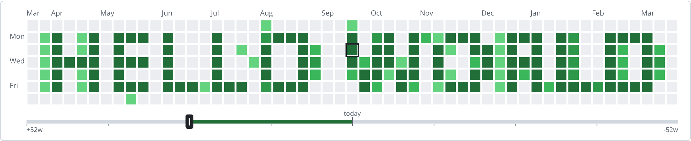

## message in github commit history plot



Paint a 53x7 grid styled like the GitHub contributions graph, map its cells to real
calendar dates, and get per-day commit-count suggestions so your profile renders the
message/picture you painted.

- no build, no backend — open `index.html` (or serve the folder)
- `demo` button simulates a fetched year: light typical-account background noise +
  a centered smooth `hello world`, with the typical recommended mapping — a one-click
  example (and how the header screenshot above was made)
- draw / erase / rect tools, fill, clear, undo
- two commit sliders: `low / erase` (background days) and `high / draw` (drawn
  days); smooth text uses the levels in between
- text: pixel auto / 5x7 / 3x5, or smooth antialiased (intermediate levels)
- fresh sessions center today (half a year of history on the left, half a year of
  plan on the right)
- week offset track under the grid moves the same way as the plot: dragging right
  shifts the dates right; `+52w` end = grid pushed into the future, `-52w` = past;
  a today marker stays in the middle; drag, click to jump, scroll over the
  plot/track to scrub, arrow keys when focused
- month labels, today outline, future dimming
- hover tooltip: date, level, ~commits, your actual commits
- auto-save (localStorage) + import/export compact `GTM1|offset|base64` string
- PNG export of the rendered grid (`timeplot-<startISO>-<endISO>.png`, 2x)
- GitHub sync (optional PAT): contribution overlay dots + "today you need ~N commits"
  with yesterday planned-vs-actual; fetch also recommends low / high from the last
  90 days (low = median day, high = p90 busy day — spikes and gaps don't skew it)
- commit plan panel: next 7 / 14 / 30 days starting today — planned level, required
  commits, done vs left once synced; "carry shortfall" adds the unmet commits of the
  last 7 days to today's number
- panels follow the workflow: 1 fetch · 2 tools · 3 text · plot · 4 info · 5 plan · 6 share
- keyboard: D/E/R tools, F fill, C clear, Ctrl+Z undo

### run

```
python3 -m http.server 8000   # then open http://localhost:8000
```

### screenshot

`header.png` is rendered by `experiments/header-shot.js` (playwright; needs a
chromium — see the script header). Regenerate with:

```
node experiments/header-shot.js
```

### files

- `index.html` — page + styles
- `core.js` — pure logic (date math, palette, storage codec, fonts)
- `app.js` — DOM, canvas, events (plot canvas + offset slider canvas + PNG export)
- `experiments/core-test.js`, `experiments/dom-smoke.js` — `node` tests
- `experiments/header-shot.js` — README screenshot renderer

### this repo

https://github.com/luncat8/github-timeplot-message.git
